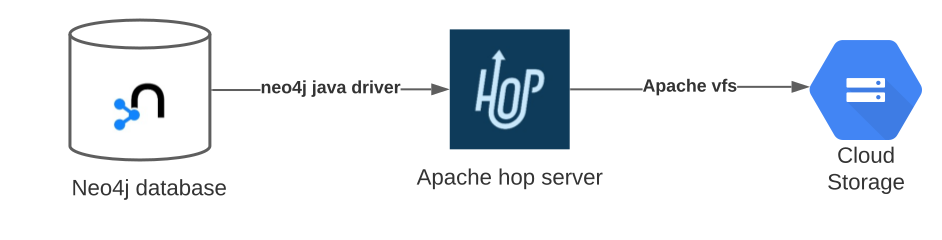
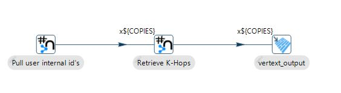
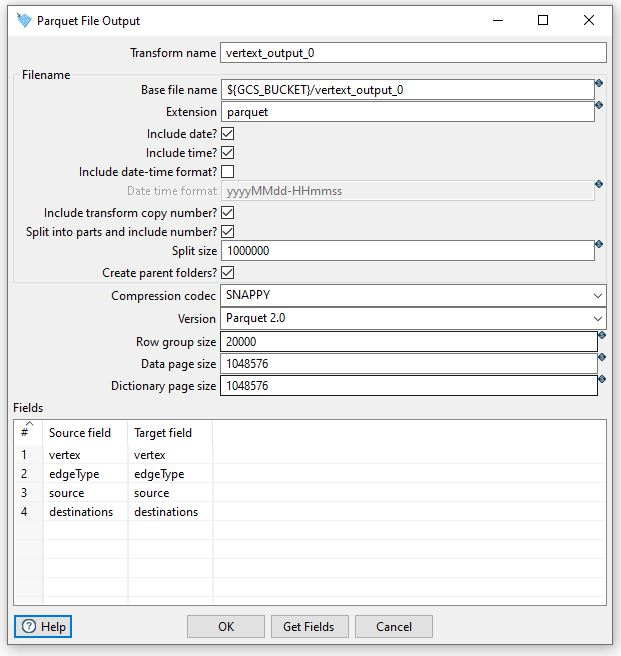
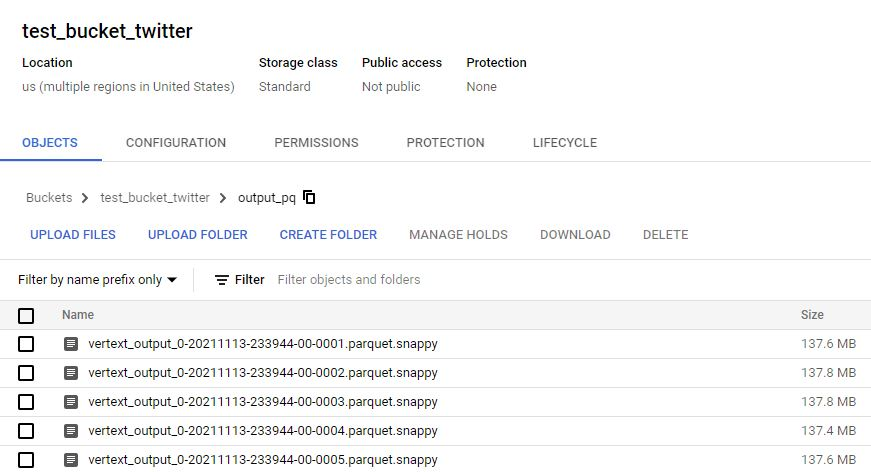
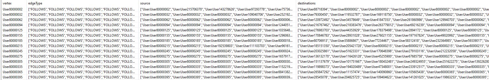
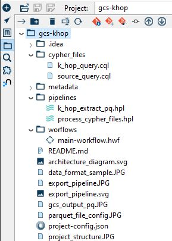

# Apache HOP Google Cloud Storage
Writing incremental parquet files from Neo4j to GCS with apache hop

### Overall Architecture


1. Apache hop is running on a gcp vm. It executes the workflows / pipelines using the **local execution
   engine and not the dataflow engine**. Using the Neo4j java driver it submits cypher queries to stream
   data from the neo4j database.<br /><br />
2. Once the data starts streaming from the database, it starts to stream the data out directly into the
   specified GCS location into csv files using apache vfs. <br /><br />

The following diagram provides an example view of the data flow inside the export pipeline



This diagram represents a hop pipeline that contains two types of transformations:

* Neo4j cypher step
  * Allows you to execute cypher statements using the neo4j java driver against a neo4j connection.
    It can return Neo4j data and also process input parameter data to execute and write into the
    database. http://hop.apache.org/manual/latest/pipeline/transforms/neo4j-cypher.html
  <br /><br />

* Parquet file output step
  * Writes data into the Apache Parquet file format, if it is executing on a server that has a
    service account with GCS access you can output the data directly to GCS with apache vfs
    by simply adding gs://url in the filename of the step. 
    http://hop.apache.org/manual/latest/pipeline/transforms/parquet-file-output.html

The (**Pull user internal id's**) transformation executes the below cypher statement:

```cypher
MATCH (n:User)
   WHERE exists((n)-[:FOLLOWS]->())
RETURN id(n) AS id
```

Once the execution starts it streams the internal node id’s and distributes the resulting rows to the following
transformations in the pipeline.<br />

Each (**Retrieve K-Hops**) transformation receives a map of neo4j node ids controlled by a batch size,
every map gets unwinded and executed against the database with the below cypher:

```cypher
UNWIND $rows AS row
WITH row.id AS id
CALL {
  WITH id
  MATCH (n:User) WHERE id(n)=id
  CALL apoc.path.subgraphAll(n, {
      maxLevel: 2,
      limit: 10
  })
  YIELD nodes, relationships
  WITH n,
  [rel in relationships | rel {type: type(rel)}] as types,
  [rel in relationships | rel {fromNode: labels(startNode(rel))[0] + ":" + apoc.convert.toString(startNode(rel).id)}] as starts,
  [rel in relationships | rel {toNode: labels(endNode(rel))[0] + ":" + apoc.convert.toString(endNode(rel).id)}] as ends
  RETURN n.id AS vertex,
  [t in types | t.type] AS edgeType,
  [s in starts | s.fromNode] AS source,
  [e in ends | e.toNode] AS destinations
}
RETURN vertex, edgeType, source, destinations
```

Each execution result of the transformations gets sent over to parquet files in gcs using apache vfs.
The execution pipeline used for this test processes 30 (K-hop streams) in parallel and can be increased
by adding more to the pipeline.<br />

Different configuration options can be set in the Parquet File output transform.<br />
The ${GCS_BUCKET} parameter is passed to the hop workflow with a value **gs://test_bucket_twitter/output_pq** 
<br /><br />
Other configuration options are available, for this example SNAPPY compression and Parquet 2.0 has been used.<br />
Under the fields section you can specify which fields to write and in which order. You can use the "Get Fields" button to populate the dialog.
The fields are obtained from the previous step in the flow, in this case the above neo4j cypher statement
<br /><br />


### Configuration & Execution Results
Neo4j server and the hop server are in the same region and zone
#### Hardware
* Neo4j Server
  * VM: n2-standard-48 (48 vCPUs, 192 GB memory)
  * SSD Persistent Disk
  * Sample graph (~300m nodes, 1.5B rels)
  * Neo4j configuration:
    * dbms.memory.heap.initial_size=31g
    * dbms.memory.heap.max_size=31g
    * dbms.memory.pagecache.size=130g
* Hop Server
  * VM: n1-standard-32 (32 vCPUs, 120 GB memory)
  * service account that has GCS access (Storage Admin or equivalent gcs write role)
  * hop memory configuration: 24g
#### Execution Time
  * Runtime
    * k-hop pipeline for 279,602,684 nodes and 2-10 hop levels total runtime was **27 minutes**
    * 30 k-hop cypher step statements with a batch of 2000 (This equals to 30 threads)
#### Output
  * GCS bucket output (290 snappy partitioned & compressed files)<br />
    
  * Output field (edgeType, source, destinations) are returned as array of strings
    
### Installation
#### Apache Hop Installation
* Download
  * Download the latest version of Apache Hop from the download page here https://hop.apache.org/download/. 
* Install
  * Unzip Hop to a folder of your choice. From that folder, you’ll be able to run the different Hop
     tools through their corresponding scripts. 
* Prerequisites
  * Hop is self-contained, all you need is a Java runtime. Hop has been developed and tested with
     Java 8, but you shouldn’t have any issues running Hop with Java 11.
### Project Structure

* **gcs-khop:** Main directory of project
* **cypher-files:** Directory that contains two cypher statement files
  * k_hop_query.cql - file that contains a cypher statement to perform k-hop queries against the
     input map, when the hop workflow executes it extracts the cypher from this file.
  * source_query.cql - file that contains a cypher statement to retrieve user ids, when the hop
     workflow executes it extracts the cypher from this file.
* **metadata:** Directory that contains hop project metadata information such as neo4j connections, runtime
   configurations etc.
  * metadata/neo4j-connection/neo4j_graph.json - is where the neo4j connection details are
     defined, this should be modified to connect to your specific database. 
* **pipelines:** Directory that contains the execution pipelines
  * process_cypher_files.hpl - reads the contents of the k_hop_query.cql & source_query.cql
     cypher files, loads them into memory and sets an environment variable for each that the next
     pipeline uses.
  * k_hop_extract_pq.hpl - executes the source cypher and the khop cypher extracted, it
     distributes the result node ids into n-number of k-hop transforms that execute the k-hop query
     as described above. It then sends those results to the parquet files directly into GCS via apache vfs.
     For this pipeline it is using 30 total k-hop transforms.
  * **If the cypher statement for k-hops is modified in the k_hop_query.cql file to return more or
     different field types, then all the transforms for khop queries and parquet outputs will also need to be
     changed to accommodate for the fields and/or new data type mappings** 
* **workflows:** Directory that contains the main workflow that executes the above pipeline in a sequence.
* **main-workflow.hwf:** executes a combination of workflow actions and pipelines sequentially to process
   the k-hop data.
### Workflow Execution & Set-up Instructions
#### Steps to run on server with hop run tool:
* Download hop project into your preferred location 
* cd into downloaded project location
  * Modify the json file located in metadata/neo4j-connection/neo4j_graph.json
  * Modify the server, databaseName, boltPort, username, password fields for your connection
  * Optionally you can create a new connection through the hop gui and move the json to the server 
    (make sure that the json is named neo4j_graph.json)
* cd into you hop installation folder and run the below project creation command:
  * ./hop-conf.sh -pc -p=gcs-k-hop -ph=/path/to//downloaded/project
  * The above command utilizes the hop-conf.sh tool to create a hop project
    * -pc project create
    * -p project name
    * -ph project home 
* From the installation folder execute the workflow with the following command:
  * /hop-run.sh -j gcs-k-hop -r local -f /path/to/workflow/file/main-workflow.hwf -p GCS_BUCKET=gs://your-bucket-name/folder,BATCH_SIZE=2000
  * The above command utilizes the hop-run.sh tool to run a workflow
    * -j project
    * -r run-configuration
    * -f filename of the workflow to run (this will be the main-workflow.hwf file in workflows directory home)
    * -p comma separated list of PARAMETER=VALUE pairs
    * & To run in background of the server session 
* In the execution command you pass the GCS_BUCKET and BATCH_SIZE parameters, once the execution stars it 
  will stream the data from neo4j into gcs

    